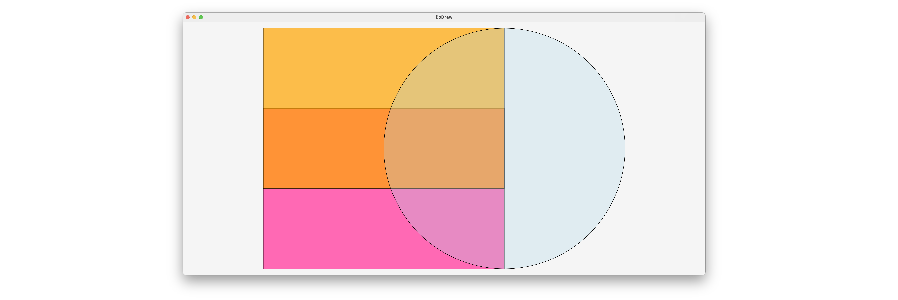

[](https://github.com/matthiasbaitsch/BoDraw/actions/workflows/test.yml)

# BoDraw

BoDraw is a simple drawing library for .NET built on top of [Avalonia](https://avaloniaui.net/).

## Quick start

Create a console app and add the `BoDraw.App` package:

```bash
dotnet new console -n BoDrawDemo
cd BoDrawDemo
dotnet add package BoDraw.App
```

Replace the contents of `Program.cs` with:

```csharp
using BoDraw;

Rectangle r1 = new Rectangle(0, 0, 12, 8);
r1.FillColor = Colors.HotPink;

Rectangle r2 = new Rectangle(0, 4, 12, 12);
r2.FillColor = Colors.Orange;
r2.FillOpacity = 0.7;

Circle c = new Circle(12, 6, 6);
c.FillColor = Colors.LightBlue;
c.FillOpacity = 0.3;

var bd = new BoDrawApp();
bd.Add(r1, r2, c);
bd.Show();
```

Run with `dotnet run` to open the drawing window.



## Shape hierarchy

All shapes inherit from `Shape`, which provides `Move(dx, dy)`, `Scale(a)`, and `Copy(dx, dy)` for basic transformations.

```
Shape - Bounds, Move(dx, dy), Scale(a), Copy(dx, dy)
├── SimpleShape
│   ├── Image
│   └── Text
├── LineLikeShape — Color, Thickness, Opacity
│   ├── Line
│   └── Polyline
└── AreaLikeShape — FillColor, FillOpacity, LineColor, LineThickness, LineOpacity
    ├── Rectangle
    ├── Polygon
    ├── Ellipse
    └── Circle
```

- **`LineLikeShape`** — open shapes defined by one or more line segments. Styled with `Color`, `Thickness`, and `Opacity`.
- **`AreaLikeShape`** — closed shapes with an interior. Support both a fill (`FillColor`, `FillOpacity`) and an outline (`LineColor`, `LineThickness`, `LineOpacity`).
- **`SimpleShape`** — `Text` renders a string at a given position; `Image` displays a raster image.

## Coordinate system

BoDraw uses **mathematical convention**: the Y-axis points upward. `Drawing` automatically fits and centers all shapes inside the render target.
