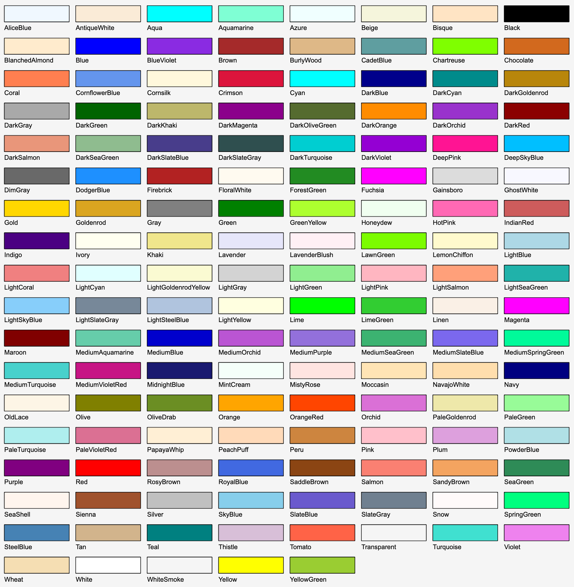

# Colors

The `Colors` class provides a set of predefined named colors that can be used for shape fill and line colors.

## Usage

Assign a color to any shape property that accepts a `Color` which can be either created from RGB (red, green, blue) values or a predefined color:

```csharp
Rectangle r = new Rectangle(0, 0, 10, 6);
r.FillColor = Colors.FromRgb(255, 128, 0);
r.LineColor = Colors.DarkRed;
```

## Predefined colors



