# Gallery

Every demo in `demo/BoDraw.App.Demo` rendered side by side with its code. Run any of them by
uncommenting the corresponding line in `demo/BoDraw.App.Demo/Program.cs` and running:

```bash
dotnet run --project demo/BoDraw.App.Demo
```

<style>
.gallery-item {
    display: flex;
    flex-wrap: wrap;
    align-items: flex-start;
    gap: 1.5rem;
    margin: 1.5rem 0 2.5rem;
}
.gallery-image {
    flex: 1 1 320px;
    max-width: 420px;
}
.gallery-image img {
    max-width: 100%;
    height: auto;
    border-radius: 4px;
}
.gallery-code {
    flex: 2 1 420px;
    min-width: 0;
}
.gallery-code pre {
    margin: 0;
}
</style>

## Fill

Basic shapes with fill color and opacity.

<div class="gallery-item">
<div class="gallery-image">

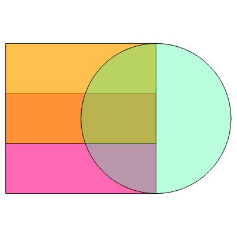

</div>
<div class="gallery-code">

[!code-csharp[](../demo/BoDraw.App.Demo/FillDemo.cs?name=snippet)]

</div>
</div>

## Group

Grouping shapes, so they can be copied, scaled, and fitted together.

<div class="gallery-item">
<div class="gallery-image">

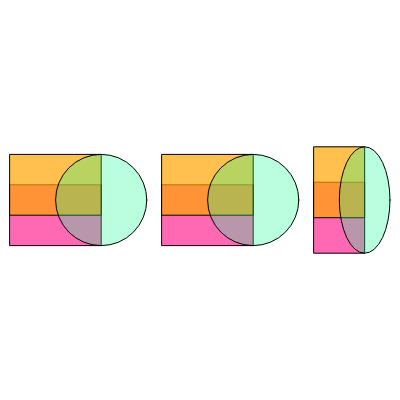

</div>
<div class="gallery-code">

[!code-csharp[](../demo/BoDraw.App.Demo/GroupDemo.cs?name=snippet)]

</div>
</div>

## Arrow

Arrows with custom color and thickness.

<div class="gallery-item">
<div class="gallery-image">

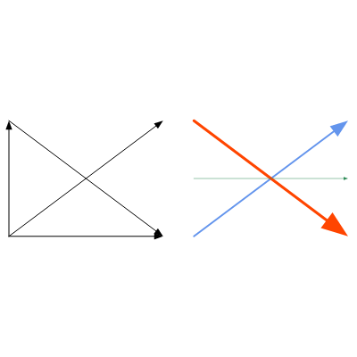

</div>
<div class="gallery-code">

[!code-csharp[](../demo/BoDraw.App.Demo/ArrowDemo.cs?name=snippet)]

</div>
</div>

## Polygon

Building up a polygon point by point, then scaling, moving, and copying it.

<div class="gallery-item">
<div class="gallery-image">

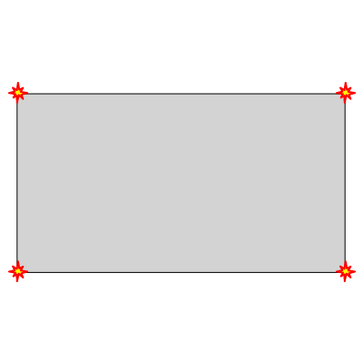

</div>
<div class="gallery-code">

[!code-csharp[](../demo/BoDraw.App.Demo/PolygonDemo.cs?name=snippet)]

</div>
</div>

## Polyline

Polylines built from individual points, flat coordinate lists, and data sequences.

<div class="gallery-item">
<div class="gallery-image">

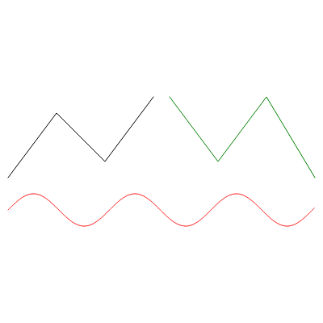

</div>
<div class="gallery-code">

[!code-csharp[](../demo/BoDraw.App.Demo/PolylineDemo.cs?name=snippet)]

</div>
</div>

## Path shape

SVG-style path data with lines, arcs, and quadratic curves.

<div class="gallery-item">
<div class="gallery-image">

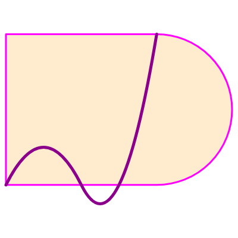

</div>
<div class="gallery-code">

[!code-csharp[](../demo/BoDraw.App.Demo/PathShapeDemo.cs?name=snippet)]

</div>
</div>

## Go logo

Repeated arcs and lines with `PathShape` used to draw a stylized logo.

<div class="gallery-item">
<div class="gallery-image">


</div>
<div class="gallery-code">

[!code-csharp[](../demo/BoDraw.App.Demo/GoLogoDemo.cs?name=snippet)]

</div>
</div>

## Clip

Clipping a large polyline to the interior of a circle.

<div class="gallery-item">
<div class="gallery-image">

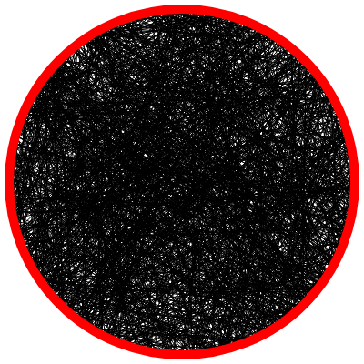

</div>
<div class="gallery-code">

[!code-csharp[](../demo/BoDraw.App.Demo/ClipDemo.cs?name=snippet)]

</div>
</div>

## Fit into

Fitting a shape into a target rectangle, with and without preserving aspect ratio.

<div class="gallery-item">
<div class="gallery-image">

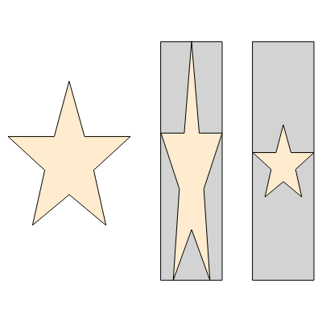

</div>
<div class="gallery-code">

[!code-csharp[](../demo/BoDraw.App.Demo/FitIntoDemo.cs?name=snippet)]

</div>
</div>

## Grid

Repeating a group of shapes on a regular grid.

<div class="gallery-item">
<div class="gallery-image">

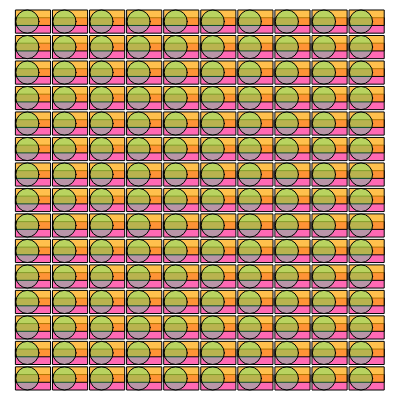

</div>
<div class="gallery-code">

[!code-csharp[](../demo/BoDraw.App.Demo/GridDemo.cs?name=snippet)]

</div>
</div>

## Grid layout

Placing shapes into named rows and columns via `GridLayout`.

<div class="gallery-item">
<div class="gallery-image">

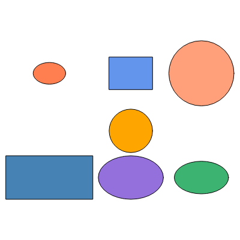

</div>
<div class="gallery-code">

[!code-csharp[](../demo/BoDraw.App.Demo/GridLayoutDemo.cs?name=snippet)]

</div>
</div>

## Text

Text justification, multi-line content, rotation, and custom fonts.

<div class="gallery-item">
<div class="gallery-image">

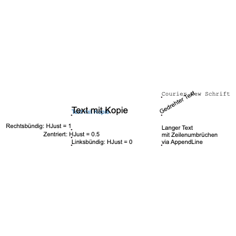

</div>
<div class="gallery-code">

[!code-csharp[](../demo/BoDraw.App.Demo/TextDemo.cs?name=snippet)]

</div>
</div>

## Dimensioning

Adding dimension lines to a shape.

<div class="gallery-item">
<div class="gallery-image">

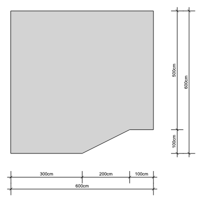

</div>
<div class="gallery-code">

[!code-csharp[](../demo/BoDraw.App.Demo/DimensioningDemo.cs?name=snippet)]

</div>
</div>

## Color table

All predefined colors from the `Colors` class, laid out in a grid. See the
[Colors](colors.md) page for details.

<div class="gallery-item">
<div class="gallery-image">

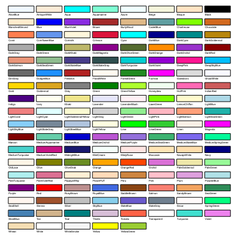

</div>
<div class="gallery-code">

[!code-csharp[](../demo/BoDraw.App.Demo/ColorTableDemo.cs?name=snippet)]

</div>
</div>

## Image read

Reading a PNG file and sampling pixel colors from it.

<div class="gallery-item">
<div class="gallery-image">


</div>
<div class="gallery-code">

[!code-csharp[](../demo/BoDraw.App.Demo/ImageReadDemo.cs?name=snippet)]

</div>
</div>

## Image write

Creating an image from scratch by setting pixel colors directly.

<div class="gallery-item">
<div class="gallery-image">

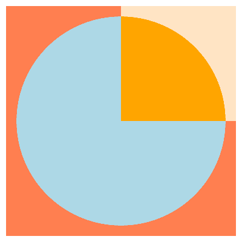

</div>
<div class="gallery-code">

[!code-csharp[](../demo/BoDraw.App.Demo/ImageWriteDemo.cs?name=snippet)]

</div>
</div>
